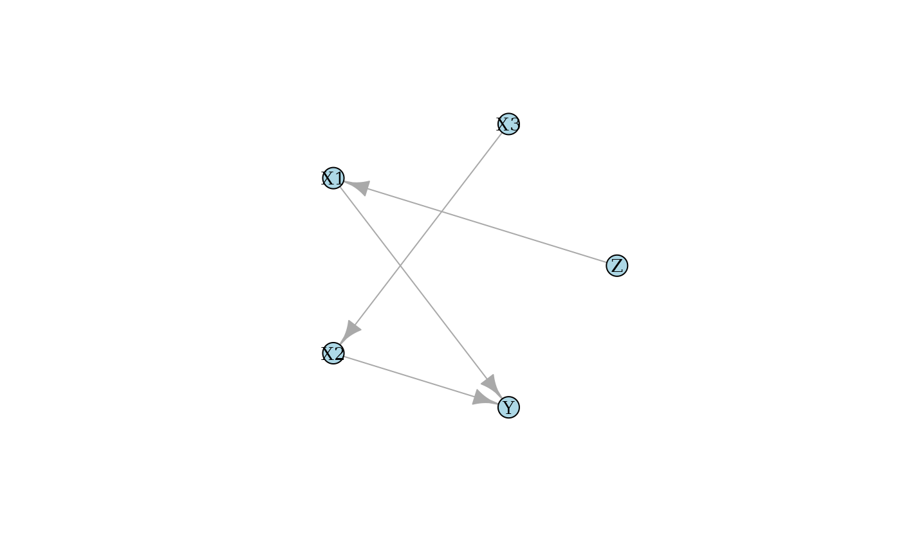

# Causal Discovery

``` r
library(causalDisco)
#> causalDisco startup:
#>   Java heap size requested: 2 GB
#>   Tetrad version: 7.6.10
#>   Java successfully initialized with 2 GB.
#>   To change heap size, set options(java.heap.size = 'Ng') or Sys.setenv(JAVA_HEAP_SIZE = 'Ng') *before* loading.
#>   Restart R to apply changes.
library(caugi)
#> 
#> Attaching package: 'caugi'
#> The following objects are masked from 'package:causalDisco':
#> 
#>     edges, nodes
```

This vignette provides an overview of causal discovery using simulated
data.

## Example of causal discovery

Suppose we have this DAG:

``` r
cg <- caugi(
    Z %-->% X1,
    X3 %-->% X2,
    X1 %-->% Y,
    X2 %-->% Y
)
layout <- caugi_layout_sugiyama(cg)
plot(cg, layout = layout, main = "True DAG")
```



We can create data from a linear Gaussian model corresponding to the
above DAG using
[`generate_dag_data()`](https://bjarkehautop.github.io/causalDisco/reference/generate_dag_data.md)

``` r
data_linear <- generate_dag_data(
  cg,
  n = 1000,
  seed = 1405
)
head(data_linear)
#> # A tibble: 6 × 5
#>         Z      X3     X1     X2      Y
#>     <dbl>   <dbl>  <dbl>  <dbl>  <dbl>
#> 1  0.476   0.301  0.0273  0.148 -1.08 
#> 2  0.497  -1.13   1.05    2.02   2.07 
#> 3  0.0111  0.727  0.553  -0.719  0.966
#> 4  0.392  -0.179  2.29    0.781  0.777
#> 5  0.800   0.0492 1.51    0.840  0.213
#> 6 -1.18    0.179  0.132   0.232  0.597
```

The R code used to generate the data is stored as an attribute of the
data frame:

``` r
attr(data_linear, "generating_model")
#> $dgp
#> $dgp$X3
#> rnorm(n, sd = 0.95)
#> 
#> $dgp$X2
#> X3 * -0.856 + rnorm(n, sd = 1.266)
#> 
#> $dgp$Z
#> rnorm(n, sd = 1.536)
#> 
#> $dgp$X1
#> Z * 0.284 + rnorm(n, sd = 1.583)
#> 
#> $dgp$Y
#> X1 * 0.172 + X2 * 0.466 + rnorm(n, sd = 0.78)
```

We can for instance use the PC algorithm from either the “tetrad”,
“pcalg”, or “bnlearn” engine to learn the DAG structure from the data.
Below, we set up the PC method with Fisher’s Z test, a significance
level of 0.05, and use pcalg as engine.

``` r
pc_pcalg <- pc(engine = "pcalg", test = "fisher_z", alpha = 0.05)
pc_result_pcalg <- disco(data_linear, method = pc_pcalg)
```

We can visualize the results using the
[`plot()`](https://bjarkehautop.github.io/causalDisco/reference/plot.md)
function:

``` r
plot(pc_result_pcalg, layout = layout, main = "PC (pcalg)")
```


The first notable feature of this plot is that some edges are directed,
while others are undirected. For example, the edge from `X1` to `Y` is
directed, indicating a causal effect of `X1` on `Y`, but not in the
reverse direction. In contrast, the edge between `X2` and `X3` is
undirected, indicating that the data alone do not provide sufficient
information to determine the causal direction. Both orientations
`X2 %-->% X3` and `X3 %-->% X2` are compatible with the observed
conditional independencies.

We demonstrate the non-identifiability of the causal direction between
`X2` and `X3` by reversing the direction of this edge in the
data-generating process above and applying the PC algorithm to the
resulting data set.

``` r
cg_reverse <- caugi(
  Z %-->% X1,
  X2 %-->% X3,
  X1 %-->% Y,
  X2 %-->% Y
)

data_linear_reverse <- generate_dag_data(
  cg_reverse,
  n = 1000,
  seed = 1405
)

pc_result_reverse <- disco(data_linear_reverse, method = pc_pcalg)
plot(pc_result_reverse, layout = layout, main = "PC (pcalg) reversed")
```


We learn the same causal structure as before, demonstrating that the
direction of influence between `X2` and `X3` cannot be determined from
the data alone.

### Non-linear example

Here, we simulate data with the same DAG structure as above, but with
non-linear relationships between the variables. This can again be done
using
[`generate_dag_data()`](https://bjarkehautop.github.io/causalDisco/reference/generate_dag_data.md),
but we need to specify the nonlinear equations manually.

``` r
n <- 1000
data_nonlinear <- generate_dag_data(
  cg,
  n = n,
  Z = runif(n, min = 0, max = 6),
  X3 = runif(n, min = -2, max = 2),
  X1 = Z^2 + rnorm(n, sd = 0.5),
  X2 = sin(0.7 * X3) + rnorm(n, sd = 1),
  Y = 0.6 * X1^2 + 0.4 * exp(X2) + rnorm(n, sd = 1.5),
  seed = 1405
)
attr(data_nonlinear, "generating_model")
#> $dgp
#> $dgp$X3
#> runif(n, min = -2, max = 2)
#> 
#> $dgp$X2
#> sin(0.7 * X3) + rnorm(n, sd = 1)
#> 
#> $dgp$Z
#> runif(n, min = 0, max = 6)
#> 
#> $dgp$X1
#> Z^2 + rnorm(n, sd = 0.5)
#> 
#> $dgp$Y
#> 0.6 * X1^2 + 0.4 * exp(X2) + rnorm(n, sd = 1.5)
```

If we try to use the PC algorithm with Fisher’s Z test again it will not
perform well due to the non-linear relationships in the data.

``` r
pc_pcalg_nonlinear <- pc(engine = "pcalg", test = "fisher_z", alpha = 0.05)
pc_result_nonlinear <- disco(data_nonlinear, method = pc_pcalg_nonlinear)
plot(pc_result_nonlinear, layout = layout, main = "PC (pcalg) non-linear")
```


As expected, the PC algorithm with Fisher’s Z test does not recover the
correct causal structure in this non-linear setting at all. Note, that
increasing the sample size does not help.

TODO: Find something that finds correct CPDAG in nonlinear-case?

## Incorporating prior knowledge

As the number of nodes increases, identifying the corresponding causal
graph from observational data becomes increasingly challenging.
Incorporating prior knowledge can constrain the search space, improve
the accuracy of causal discovery, and, in particular, resolve cases
where the data alone are insufficient to determine causal direction.

Suppose we know that `v` and `w` do not cause `x`. This can be specified
as follows:

``` r
kn <- knowledge(
  data_linear,
  X1 %!-->% Z,  # X1 does not cause Z
  X2 %!-->% X3   # X2 does not cause X3
)
plot(kn)
```


We can then incorporate this knowledge into the PC algorithm as follows:

``` r
pc_pcalg <- pc(engine = "bnlearn", test = "fisher_z", alpha = 0.05)
pc_result_with_knowledge <- disco(data_linear, method = pc_pcalg, knowledge = kn)
plot(pc_result_with_knowledge, layout = layout, main = "PC (pcalg) with knowledge")
```


It now correctly recovers the true DAG structure with this extra
knowledge.

For more information about how to incorporate knowledge, see the
[knowledge
vignette](https://bjarkehautop.github.io/causalDisco/articles/knowledge.md).
