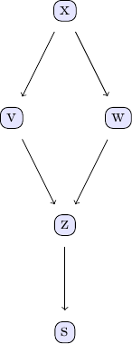

# causalDisco

``` r
library(causalDisco)
#> causalDisco startup:
#>   Java heap size requested: 2 GB
#>   Tetrad version: not installed
#>   Tetrad is not installed. Run install_tetrad() to install it.
#>   To change heap size, set options(java.heap.size = 'Ng') or Sys.setenv(JAVA_HEAP_SIZE = 'Ng') *before* loading.
#>   Restart R to apply changes.
```

This vignette provides an overview of the `causalDisco` package, which
offers tools for causal discovery from observational data. It covers the
main features of the package, including various causal discovery
algorithms, knowledge incorporation, and result visualization.

## Simple example of causal discovery

The example discussed in this section is inspired by the Julia package
CausalDiscovery.jl with their PC algorithm example, which can be found
here [PC algorithm example in
CausalDiscovery.jl](https://mschauer.github.io/CausalInference.jl/latest/examples/pc_basic_examples/).

We will consider data from the following DAG, which is also discussed in
chapter 2 of Judea Pearl’s book.



DAG example

We create data from a linear Gaussian model corresponding to the above
DAG:

``` r
set.seed(1405)
n <- 1000
x <- rnorm(n)
v <- x + rnorm(n)*0.5
w <- x + rnorm(n)*0.5
z <- v + w + rnorm(n)*0.5
s <- z + rnorm(n)*0.5

data_simple <- data.frame(x = x, v = v, w = w, z = z, s = s)
head(data_simple)
#>            x           v          w          z          s
#> 1  0.2724785  0.07687489  1.2131219  1.4542158  0.2649549
#> 2  0.3572619  0.81022383  0.4049109  1.5767672  1.5394264
#> 3 -0.8616620 -0.68388923 -0.3195188 -1.1415913 -1.2647045
#> 4  0.8083350  1.61458098  1.2132504  3.0666677  3.0334703
#> 5  0.6127352  0.42484707  0.4253022  0.7889983  0.7937421
#> 6 -0.6240686 -0.23225274 -0.7201852 -0.4876655 -0.7977492
```

We can use the PC algorithm from either the “tetrad”, “pcalg”, or
“bnlearn” engine to discover the causal structure. Below, we set up the
PC method with Fisher’s Z test and a significance level of 0.05 and
“pcalg” and “bnlearn” engines.

``` r
pc_pcalg <- pc(engine = "pcalg", test = "fisher_z", alpha = 0.05)
pc_bnlearn <- pc(engine = "bnlearn", test = "fisher_z", alpha = 0.05)

pc_result_pcalg <- disco(data_simple, method = pc_pcalg)
pc_result_bnlearn <- disco(data_simple, method = pc_bnlearn)
```

We can visualize the results from each engine:

``` r
par(mfrow = c(1, 2))
plot(pc_result_pcalg, main = "PC (pcalg)")
plot(pc_result_bnlearn, main = "PC (bnlearn)")
```


``` r
par(mfrow = c(1, 1))
```

(Ignore that PC bnlearn doesn’t work correctly for now)

The first notable feature of this plot is that some edges have arrows,
while others do not. For instance, the edge from `v` to `z` is directed,
indicating that `v` influences `z`, but not vice versa. In contrast, the
edge between `x` and `w` has no arrows at either end (and with dashed
lines), showing that the direction of causal influence cannot be
determined from the data alone. Both directions; `x` to `w` and `w` to
`x`, are consistent with the observed data. We can demonstrate this by
reversing the direction of influence in the data-generating process
above and applying the PC algorithm to the new data set:

``` r
set.seed(1405)
n <- 1000
v <- rnorm(n)
x <- x + rnorm(n)*0.5
w <- x + rnorm(n)*0.5
z <- v + w + rnorm(n)*0.5
s <- z + rnorm(n)*0.5

data_simple <- data.frame(x = x, v = v, w = w, z = z, s = s)

pc_pcalg_reversed <- pc(engine = "pcalg", test = "fisher_z", alpha = 0.05)
pc_result_reversed <- disco(data_simple, method = pc_pcalg_reversed)
plot(pc_result_reversed, main = "PC (pcalg) reversed")
```


We learn the same causal structure as before, demonstrating that the
direction of influence between `x` and `w` cannot be determined from the
data alone.

## Incorporating prior knowledge

To be continued…
