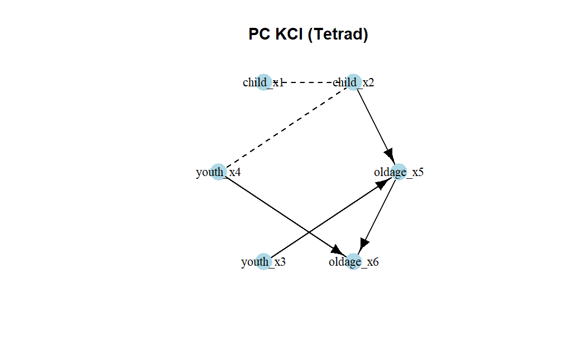

# causalDisco

``` r
library(causalDisco)
#> causalDisco startup:
#>   Java heap size requested: 2 GB
#>   Tetrad version: 7.6.10
#>   Java successfully initialized with 2 GB.
#>   To change heap size, set options(java.heap.size = 'Ng') or Sys.setenv(JAVA_HEAP_SIZE = 'Ng') *before* loading.
#>   Restart R to apply changes.
```

This vignette provides an overview of the causalDisco package, which
offers tools for causal discovery from observational data. It covers the
main features of the package, including various causal discovery
algorithms, knowledge incorporation, and result visualization.

## Running causal discovery algorithms

We will for this section use the `num_data` dataset included in the
package for demonstrating how to run causal discovery algorithms.

``` r
data(num_data)
head(num_data)
#>         X1        X2       X3         Z        Y
#> 1 3.900715  7.048325 6.964806 10.272479 15.35505
#> 2 4.736112  6.236746 5.666022 10.357262 23.36749
#> 3 4.657992 12.169805 9.127046  9.138338 25.32495
#> 4 5.176469  6.392344 6.101088 10.808335 26.75643
#> 5 4.535538 10.305236 7.465185 10.612735 22.67612
#> 6 4.885914 10.018856 7.413312  9.375931 28.03132
```

We can use several algorithms from the causalDisco package to discover
the causal structure from this data. Here is an example using the
Peter-Clark (PC) algorithm from Tetrad with the Kernel Conditional
Independence Test (KCI).

``` r
if (check_tetrad_install()$installed && check_tetrad_install()$java_ok) {
  pc_tetrad <- pc(engine = "tetrad", test = "kci", alpha = 0.05)
  pc_result_tetrad <- disco(num_data, method = pc_tetrad)
  plot(pc_result_tetrad, main = "PC KCI (Tetrad)")
}
```



or the PC algorithm from bnlearn with Fisher’s Z test:

``` r
pc_bnlearn <- pc(engine = "bnlearn", test = "fisher_z", alpha = 0.05)
pc_result_bnlearn <- disco(num_data, method = pc_bnlearn)
plot(pc_result_bnlearn, main = "PC Fisher Z (bnlearn)")
```


or the generalized score equivalence (GES) algorithm from pcalg with the
SEM-BIC score:

``` r
ges_pcalg <- ges(engine = "pcalg", score = "sem_bic")
ges_result <- disco(num_data, method = ges_pcalg)
plot(ges_result, main = "GES SEM-BIC (pcalg)")
```


## Incorporating knowledge

We will for this section use the dataset `tpc_example`, which contains
variables measured at three different life stages: childhood, youth, and
old age.

``` r
data(tpc_example)
head(tpc_example)
#>   child_x2   child_x1    youth_x4 youth_x3  oldage_x6  oldage_x5
#> 1        0 -0.7104066 -0.07355602        1  6.4984994  3.0740123
#> 2        0  0.2568837 -1.16865142        1  0.3254685  1.9726530
#> 3        0 -0.2466919 -0.63474826        1  4.1298927  1.9666697
#> 4        1  1.6524574  0.97115845        0 -7.9064009 -4.5160676
#> 5        0 -0.9516186  0.67069597        0  1.7089134  0.7903853
#> 6        1  1.9549723 -0.65054654        0 -6.9758928 -3.2107342
```

Thus, we have some prior knowledge about the temporal ordering of the
variables. That is, we know the variables measured in childhood cannot
be caused by variables measured in youth or old age, and variables
measured in youth cannot be caused by variables measured in old age.

This can be encoded in a `knowledge` object as follows:

``` r
kn <- knowledge(
  tpc_example,
  tier(
    child ~ starts_with("child"),
    youth ~ starts_with("youth"),
    oldage ~ starts_with("oldage")
  )
)
```

You can view the knowledge object using
[`print()`](https://caugi.org/reference/print.html),
[`summary()`](https://rdrr.io/r/base/summary.html) or
[`plot()`](https://caugi.org/reference/plot.html):

``` r
print(kn)
#> 
#> ── Knowledge object ────────────────────────────────────────────────────────────
#> 
#> ── Tiers ──
#> 
#>   tier  
#>   <chr> 
#> 1 child 
#> 2 youth 
#> 3 oldage
#> ── Variables ──
#>   var       tier  
#>   <chr>     <chr> 
#> 1 child_x1  child 
#> 2 child_x2  child 
#> 3 youth_x3  youth 
#> 4 youth_x4  youth 
#> 5 oldage_x5 oldage
#> 6 oldage_x6 oldage
summary(kn)
#> ── Knowledge summary ──
#> Tiers: 3
#> Variables: 6
#> Required edges: 0
#> Forbidden edges: 0
#> 
#> ── Variables per Tier
#> child: 2 variables
#> oldage: 2 variables
#> youth: 2 variables
plot(kn, main = "Temporal Knowledge")
```


We can then incorporate this knowledge into any algorithm like above.
Here we use the Temporal Peter-Clark (tpc) algorithm from causalDisco
with the regression-based information loss test:

``` r
tpc_method <- tpc(engine = "causalDisco", test = "reg")
tpc_result <- disco(tpc_example, method = tpc_method, knowledge = kn)
```

Similarly, we can view the results using
[`print()`](https://caugi.org/reference/print.html),
[`summary()`](https://rdrr.io/r/base/summary.html) or
[`plot()`](https://caugi.org/reference/plot.html):

``` r
print(tpc_result)
#> 
#> ── caugi graph ─────────────────────────────────────────────────────────────────
#> Graph class: PDAG
#> 
#> ── Edges ──
#> 
#>   from      edge  to       
#>   <chr>     <chr> <chr>    
#> 1 child_x1  -->   child_x2 
#> 2 child_x2  -->   oldage_x5
#> 3 child_x2  -->   youth_x4 
#> 4 oldage_x5 ---   oldage_x6
#> 5 youth_x3  -->   oldage_x5
#> 6 youth_x4  -->   oldage_x6
#> ── Nodes ──
#>   name     
#>   <chr>    
#> 1 child_x2 
#> 2 child_x1 
#> 3 youth_x4 
#> 4 youth_x3 
#> 5 oldage_x6
#> 6 oldage_x5
#> ── Knowledge object ────────────────────────────────────────────────────────────
#> ── Tiers ──
#> 
#>   tier  
#>   <chr> 
#> 1 child 
#> 2 youth 
#> 3 oldage
#> ── Variables ──
#>   var       tier  
#>   <chr>     <chr> 
#> 1 child_x1  child 
#> 2 child_x2  child 
#> 3 youth_x3  youth 
#> 4 youth_x4  youth 
#> 5 oldage_x5 oldage
#> 6 oldage_x6 oldage
summary(tpc_result)
#> ── caugi graph summary ─────────────────────────────────────────────────────────
#> Graph class: PDAG
#> Nodes: 6
#> Edges: 6
#> 
#> ── Knowledge summary ──
#> 
#> Tiers: 3
#> Variables: 6
#> Required edges: 0
#> Forbidden edges: 0
#> 
#> ── Variables per Tier
#> child: 2 variables
#> oldage: 2 variables
#> youth: 2 variables
plot(tpc_result, main = "TPC reg_test with Temporal Knowledge (causalDisco)")
```


## Next steps

For more information about how to incorporate knowledge, see the
[knowledge
vignette](https://bjarkehautop.github.io/causalDisco/articles/knowledge.md).

For more information about causal discovery, see the [causal discovery
vignette](https://bjarkehautop.github.io/causalDisco/articles/causal-discovery.md).
