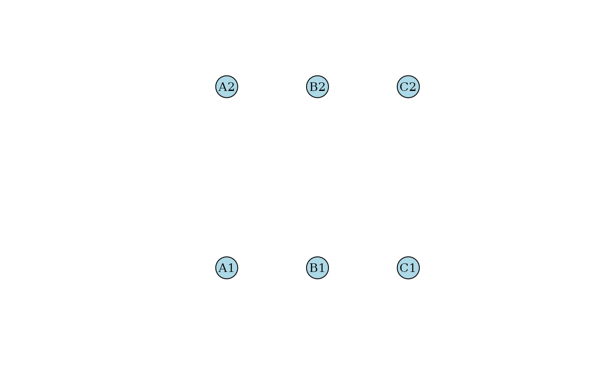
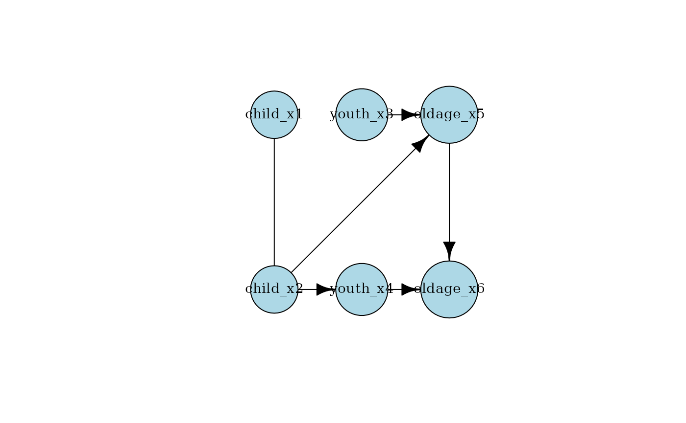
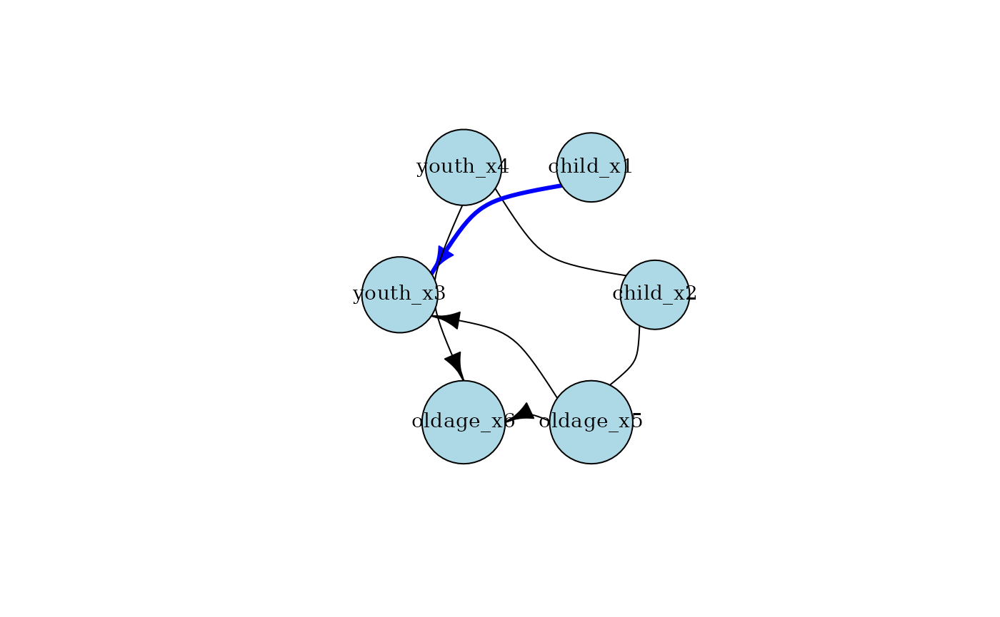

# knowledge

``` r
library(causalDisco)
#> causalDisco startup:
#>   Java heap size requested: 2 GB
#>   Tetrad version: not installed
#>   Tetrad is not installed. Run install_tetrad() to install it.
#>   To change heap size, set options(java.heap.size = 'Ng') or Sys.setenv(JAVA_HEAP_SIZE = 'Ng') *before* loading.
#>   Restart R to apply changes.
```

This vignette demonstrates how to use the `knowledge` function to
incorporate prior knowledge into causal discovery algorithms.

## Tier knowledge

We can define tier knowledge to specify temporal or logical ordering
among variables. For example, consider a dataset with three groups of
variables: `child`, `youth`, and `old`. We can specify that `child`
variables precede `youth` variables, which in turn precede `old`
variables. To do this, we use the `tier` function within `knowledge`.

### Creating a tierred knowledge object

A tier knowledge object can be created by specifying tiers and their
associated variables. If using numeric tiers, lower numbers indicate
earlier tiers, while otherwise it’s based on the order of appearance.
Thus, the below specifies different ways to encode the same tier
knowledge:

``` r
kn <- knowledge(
  tier(
    1 ~ c(A1, A2),
    2 ~ c(B1, B2),
    3 ~ c(C1, C2)
  )
)

# Same object, since it gets ordered numerically by tier number
kn_same <- knowledge(
  tier(
    1 ~ c(A1, A2),
    3 ~ c(C1, C2),
    2 ~ c(B1, B2)
  )
)

# Not actually the same object (since kn_almost$vars lists the tiers, and thus says 10, 20, 30. But
# it functions the same as kn in causal discovery)
kn_almost <- knowledge(
  tier(
    10 ~ c(A1, A2),
    30 ~ c(C1, C2),
    20 ~ c(B1, B2)
  )
)

# Again, not actually the same object, but functions the same.
kn_also_almost <- knowledge(
  tier(
    A ~ c(A1, A2),
    B ~ c(B1, B2),
    C ~ c(C1, C2)
  )
)
```

We can visualize the tiers using:

``` r
plot(kn)
```



### Using tier knowledge with a dataset

Suppose we want to use the `tpc_example` dataset from the causalDisco
package:

``` r
data("tpc_example")
head(tpc_example)
#>   child_x2   child_x1    youth_x4 youth_x3  oldage_x6  oldage_x5
#> 1        0 -0.7104066 -0.07355602        1  6.4984994  3.0740123
#> 2        0  0.2568837 -1.16865142        1  0.3254685  1.9726530
#> 3        0 -0.2466919 -0.63474826        1  4.1298927  1.9666697
#> 4        1  1.6524574  0.97115845        0 -7.9064009 -4.5160676
#> 5        0 -0.9516186  0.67069597        0  1.7089134  0.7903853
#> 6        1  1.9549723 -0.65054654        0 -6.9758928 -3.2107342
```

We can pass the dataset to `knowledge`, which also checks that the
specified variables exist:

``` r
kn <- knowledge(
  tpc_example,
  tier(
    child ~ c(child_x1, child_x2),
    youth ~ c(youth_x3, youth_x4),
    old ~ c(oldage_x5, oldage_x6)
  )
)
```

#### Simplifying variable selection

To make specifying variables easier, you can use tidyselect helpers such
as `starts_with`:

``` r
kn <- knowledge(
  tpc_example,
  tier(
    child ~ starts_with("child"),
    youth ~ starts_with("youth"),
    old ~ starts_with("old")
  )
)
```

We can plot the knowledge to visualize the tiers:

``` r
plot(kn)
```


### Using tier knowledge with causal discovery

Now that we have defined our knowledge, we can use it with causal
discovery algorithms such as the temporal GES algorithm `tges` with
engine `causalDisco` and score temporal BIC (`tbic`):

``` r
cd_tges <- tges(engine = "causalDisco", score = "tbic")
disco_cd_tges <- disco(data = tpc_example, method = cd_tges, knowledge = kn)
```

The causal discovery algorithms respects the provided knowledge, and we
can plot the resulting causal graph.

``` r
plot(disco_cd_tges)
```



## Required and forbidden knowledge

WIP and syntax changes coming soon.

## Engine specific information about knowledge

### bnlearn

Tier, required and forbidden knowledge are all supported with bnlearn
engines. Note, that you can get a harmless(?) warning from bnlearn when
using required knowledge.

``` r
data("tpc_example")

kn <- knowledge(
  tpc_example,
  required(child_x1 ~ youth_x3)
)

bnlearn_pc <- pc(engine = "bnlearn", test = "fisher_z", alpha = 0.05)
output <- disco(data = tpc_example, method = bnlearn_pc, knowledge = kn)
#> Warning in vstruct.apply(arcs = arcs, vs = vs, nodes = nodes, debug = debug):
#> vstructure child_x2 -> oldage_x5 <- youth_x3 is not applicable, because one or
#> both arcs are oriented in the opposite direction.
```

But the resulting causal graph respects the knowledge correctly
nevertheless.

``` r
plot(output)
```



### causalDisco

WIP. Currently causalDisco only works correctly with tier and required
knowledge.

### pcalg

Note, that pcalg only supports forbidden edge knowledge. See
[`?as_pcalg_constraints`](https://bjarkehautop.github.io/causalDisco/reference/as_pcalg_constraints.md)
for details.

### Tetrad

WIP. Currently only implemented correctly for forbidden knowledge.
